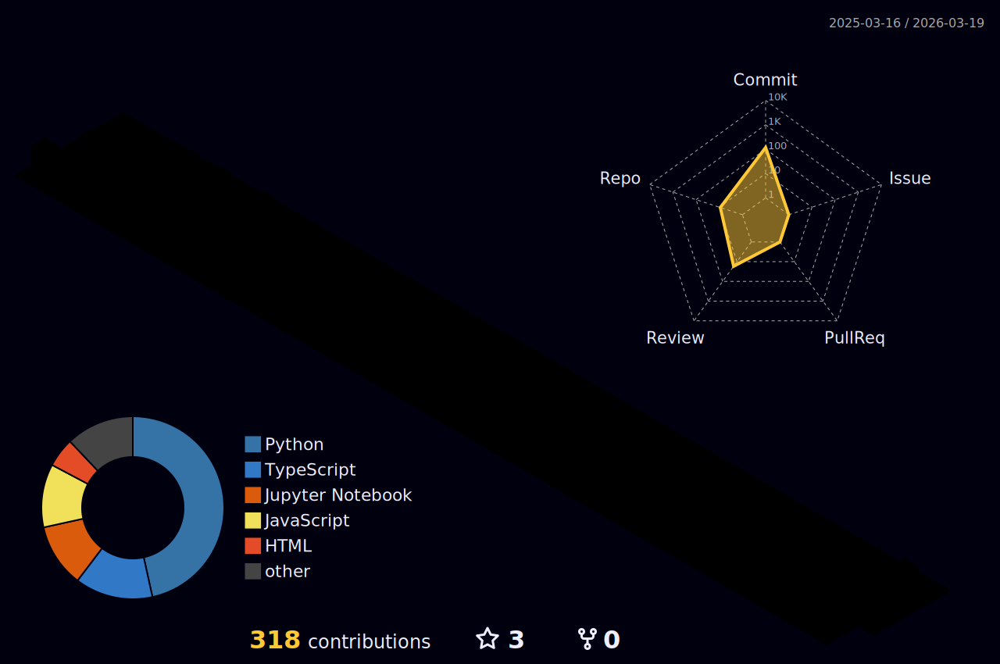

<h1 align="center">Subin Shakya

</h1>

<h2 align="center"> 😎 Holopin Badges: </h2>

<!--

<h2 align="center"> 🪶 GSSoC 2024 - Extd Badges  </h2>

  

 

  

-->

<h2 align="center"> 🧑🏻‍💻 Tech Stack: </h2>

  

-000000?style=for-the-badge&logo=automattic&logoColor=white)

<h2 align="center">  📊 GitHub Contribution Graph </h2>

  

<!--

-->

<!-- <h2 align="center"> 📊 GitHub Stats: </h2>
 
<table align="center">
  <tr>
    <td>
      
    </td>
    <td>
      
    </td>
  </tr>
  <tr>
    <td colspan="2" align="center">
      
    </td>
  </tr>
</table>

<h2 align="center"> 🏆 GitHub Trophies </h2>

--- -->

